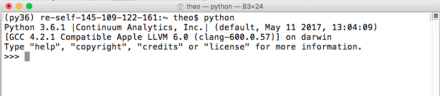

# Getting started

## Installing Python

Python is a language and not a program and thus there are many different
ways you can run code in Python. For the course, it is important that
you have Python 3 installed and running on your machine and be able to
run Jupyter Notebooks as well as install packages. There are different
ways to install Python on your computer. We will provide instructions on
two widely used solutions:

Using Anaconda or using Python natively (we will discuss pros and cons
of them in our course as well). Whatever solution you go for, make sure
it works on your system.

### Option 1: installing Python via Anaconda

#### Windows

  - Open [https://www.anaconda.com/download/ ](https://www.anaconda.com/download/)with
    your web browser.

  - Download the Python 3.7 (or later) installer for Windows.

  - Install Python 3.7 (or later) using all of the defaults for
    installation but **make sure to check Make Anaconda the default
    Python**.

#### Mac OS X

  - Open [https://www.anaconda.com/download/](https://www.anaconda.com/download/) with
    your web browser.

  - Download the Python 3.7 (or later) installer for OS X.

  - Install Python 3.7 (or later) using all of the defaults for
    installation 

  -
#### Linux

  - Open [https://www.anaconda.com/download/](https://www.anaconda.com/download/) with
    your web browser.

  - Download the Python 3.7 (or later) installer for Linux.

  - Install Python 3.7 (or later) using all of the defaults for
    installation. (Installation requires using the shell. If you aren't
    comfortable doing this, come to one of the consultation hours and we
    will help you)

  - Open a terminal window.

  - Type bash Anaconda- and then press tab. The name of the file you
    just downloaded should appear.

  - Press enter. You will follow the text-only prompts. When there is a
    colon at the bottom of the screen press the down arrow to move down
    through the text. Type yes and press enter to approve the license.
    Press enter to approve the default location for the files. Type yes
    and press enter to prepend Anaconda to your PATH (this makes the
    Anaconda distribution the default Python).

#### How do I know if the installation worked?

Open the **Terminal** (in a Mac or Linux computer) or **Anaconda
Prompt** (in Windows), and type python.

Python should start, and should say "3.7" (perhaps 3.8, 3.9... etc.) and
"Continuum Analytics" or "Anaconda" somewhere in the header.

To quit Python, just type exit() and press enter

See example below: 

*Not sure how to open Terminal/Anaconda Prompt?*

  - [Mac OSX instructions on YouTube - online
    tutorial](https://www.youtube.com/watch?v=zw7Nd67_aFw)

  - For Windows, please use Anaconda Prompt (search for it in your
    computer)

Still unsure? Check the section below.

#### Check out some tutorials online

There are online tutorials offering specific advice
for [Windows](https://www.youtube.com/watch?v=xxQ0mzZ8UvA) and [Mac
OSX](https://www.youtube.com/watch?v=TcSAln46u9U).

Please note that you need Python 3.9, and the Anaconda website may look
a bit different from what you see in the video.

Here is another [video
tutorial](https://www.youtube.com/watch?v=YJC6ldI3hWk) with
information on how to install and use Anaconda. It also covers a lot of
additional information that you will not need in the course. For now, as
long as you managed to get Anaconda installed for now - you're more than
OK\!

### Option 2: using Python natively  
*based on Chapter 1 of Atteveldt, Trilling & Arcila Calderón (2021)*

Oftentimes, you will have Python already installed on your computer.
There are different ways to check if you already have it. For example,
if you are using a Mac, you can open your system terminal[^1] and type
python -V or python –version and you will get a message with the version
that is installed by default on your computer.

If you do not have already Python on your computer, the first thing will
be to download it and install it from its official
[webpage](https://www.python.org/downloads/), selecting the right
software according to your operating system (Windows, Linux/UNIX, Mac OS
X). 

During the installation, additional features will be installed. They
include *pip*, a basics package that you will need to install more
packages for Python. In addition, you might be asked if you want to add
Python to your path, which means that you set the path variable in order
to call the executable software from your system terminal just by typing
the word python. We recommend selecting this option.

####  Installing Jupyter

In the course, we will run our Python code using Jupyter Notebooks. They
run as a web application that allows you to create documents that
contain code and text (and also equations and visualizations). We will
discuss other options to run Python in the course.

Jupyter is already installed if you went for option 1 and installed
Python via Anaconda. If you are using the native installation, you will
need to install it by running pip install notebook on your systems’
terminal.

You can start Jupter Notebook by typing jupyter notebook in your
system’s terminal (or in Anaconda prompt if you installed Python via
Anaconda on a Windows computer).

There is a more fancy and moden environment called JupyterLab -- using JupyterLab instead of plain JupyterNotebooks is fine as well.

[^1] Not sure what is and how to open Terminal? Have a look at this short
    [video](https://www.youtube.com/watch?v=zw7Nd67_aFw).
